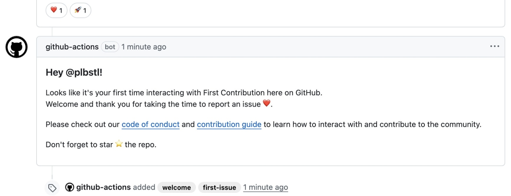

# First Contribution 🤝

[](https://github.com/marketplace/actions/first-contribution)
[](https://github.com/plbstl/first-contribution/actions/workflows/ci.yml)
[](https://github.com/plbstl/first-contribution/actions/workflows/github-code-scanning/codeql)
[](./assets/tests-report.md)
[](./assets/coverage-report.md)
[](./assets/jscpd-report.md)
[](./LICENSE)
[](https://app.fossa.com/projects/git%2Bgithub.com%2Fplbstl%2Ffirst-contribution?ref=badge_shield&issueType=license)
[](https://app.fossa.com/projects/git%2Bgithub.com%2Fplbstl%2Ffirst-contribution?ref=badge_shield&issueType=security)

> A GitHub Action to automatically welcome and encourage first-time contributors.

- **Flexible Tracking**: Greet users on their first issue and first pull request separately, or just once on their very
  first interaction.
- **Custom Messages**: Define unique messages for different events like opening an issue, merging a PR, or closing a
  contribution.
- **Message Reuse**: Avoid repetition by reusing message content from other inputs.
- **Placeholder Support**: Use `{fc-author}` in any message to mention the contributor by their GitHub username.
- **Automatic Labeling**: Apply labels to issues and PRs from new contributors to help with triage.
- **Automatic Emoji Reactions**: Add one or more emoji reactions to the contributor's issue or pull request.
- **Smart Contributor Detection**: Avoids misidentifying existing repository committers as new by checking their commit
  history in addition to their issue and pull request activity.

<p align="center">

</p>

## 🚀 Quick Start

Add the following workflow to `.github/workflows/welcome.yml`:

```yaml
name: Welcome First-Time Contributor

on:
  issues:
    types: opened
  pull_request_target:
    types: opened

permissions: {}

jobs:
  welcome:
    runs-on: ubuntu-latest
    permissions:
      issues: write # Required to post comments and labels on issues
      pull-requests: write # Required to post comments and labels on PRs
    steps:
      - uses: plbstl/first-contribution@v4
        with:
          labels: first-contribution
          issue-opened-msg: |
            ### Hey @{fc-author}! :wave:

            Thanks for opening your first issue. Welcome to the community! :heart:
          pr-opened-msg: |
            ### Hey @{fc-author}! :tada:

            Thanks for opening your first pull request. We really appreciate it.
```

That’s it. Your repository will now automatically greet newcomers.

> [!IMPORTANT]
>
> Your workflow **must** have the correct `permissions` for the action to post comments, labels, and reactions.

## ⚙️ Inputs

| Input                   | Description                                                                                                                                                              | Default               |
| ----------------------- | ------------------------------------------------------------------------------------------------------------------------------------------------------------------------ | --------------------- |
| `token`                 | GitHub token for API access.                                                                                                                                             | `${{ github.token }}` |
| `issue-opened-msg`      | Message to post on a first-time issue.                                                                                                                                   | `''`                  |
| `pr-opened-msg`         | Message to post on a first-time PR.                                                                                                                                      | `''`                  |
| `issue-completed-msg`   | Message to post when the first issue is closed as completed.                                                                                                             | `''`                  |
| `issue-not-planned-msg` | Message to post when the first issue is closed as not planned.                                                                                                           | `''`                  |
| `pr-merged-msg`         | Message to post when the first PR is merged.                                                                                                                             | `''`                  |
| `pr-closed-msg`         | Message to post when the first PR is closed without merging.                                                                                                             | `''`                  |
| `labels`                | Comma-separated list of labels for any first contribution.                                                                                                               | `''`                  |
| `issue-labels`          | Labels for first-time issues (overrides `labels`).                                                                                                                       | `''`                  |
| `pr-labels`             | Labels for first-time PRs (overrides `labels`).                                                                                                                          | `''`                  |
| `contribution-mode`     | `once`: Greet on the absolute first interaction.<br/>Default: Greet on the first issue **and** first PR.                                                                 | `''`                  |
| `fail-on-error`         | If `true`, fails the workflow step if an error occurs.                                                                                                                   | `false`               |
| `reactions`             | Comma-separated list of reactions to add to the issue or pull request body.<br/>**Valid options**: `+1`, `-1`, `laugh`, `confused`, `heart`, `hooray`, `rocket`, `eyes`. | `''`                  |
| `issue-reactions`       | Comma-separated list of reactions to add **only** to the issue body.<br/>**Valid options**: `+1`, `-1`, `laugh`, `confused`, `heart`, `hooray`, `rocket`, `eyes`.        | `''`                  |
| `pr-reactions`          | Comma-separated list of reactions to add **only** to the pull request body.<br/>**Valid options**: `+1`, `-1`, `laugh`, `confused`, `heart`, `hooray`, `rocket`, `eyes`. | `''`                  |

> [!NOTE]
>
> The `labels` and `reactions` inputs are only applied when a contribution is **opened**. They are ignored for `closed`
> events.

## 📤 Outputs

| Output        | Type    | Description                                  |
| ------------- | ------- | -------------------------------------------- |
| `type`        | string  | Contribution type (`issue` or `pr`).         |
| `number`      | integer | The issue or PR number.                      |
| `username`    | string  | The contributor's GitHub username.           |
| `comment-url` | string  | The URL of the comment posted by the action. |

## 📚 Examples

- [Add Reactions to a First Contribution](#add-reactions-to-a-first-contribution)
- [Welcome a Contributor Only Once](#welcome-a-contributor-only-once)
- [Add New Contributor After Merge](#add-new-contributor-after-merge)
- [Detailed Configuration](#detailed-configuration)

### Add Reactions to a First Contribution

Automatically react to a new issue or PR with one or more emojis.

```yaml
name: Welcome with Reactions

on:
  issues:
    types: opened
  pull_request_target:
    types: opened

permissions: {}

jobs:
  welcome:
    runs-on: ubuntu-latest
    permissions:
      issues: write
      pull-requests: write
    steps:
      - uses: plbstl/first-contribution@v4
        with:
          issue-opened-msg: Welcome, @{fc-author}! Thanks for opening your first issue.
          pr-opened-msg: Thanks for your first PR, @{fc-author}!
          issue-reactions: eyes
          pr-reactions: +1, rocket
```

### Welcome a Contributor Only Once

Use `contribution-mode: once` to greet a user only on their absolute first interaction, whether it's an issue or a PR.

```yaml
name: Welcome a Contributor (Once)

on:
  issues:
    types: opened
  pull_request_target:
    types: opened

permissions: {}

jobs:
  welcome:
    runs-on: ubuntu-latest
    permissions:
      issues: write
      pull-requests: write
    steps:
      - uses: plbstl/first-contribution@v4
        with:
          contribution-mode: once
          issue-opened-msg: >
            Welcome @{fc-author}! Thanks for your first contribution to our project. We're excited to have you here!
            :heart:
          # Reuse the same message for PRs for a consistent welcome
          pr-opened-msg: issue-opened-msg
```

### Add New Contributor After Merge

Add a new contributor after their first PR is merged using the
[@all-contributors bot](https://github.com/apps/allcontributors).

```yaml
name: Add New Contributor

on:
  pull_request_target:
    types: closed

permissions: {}

jobs:
  add-contributor:
    # This job only runs for merged PRs
    if: github.event.pull_request.merged == true
    runs-on: ubuntu-latest
    permissions:
      pull-requests: write
    steps:
      - uses: plbstl/first-contribution@v4
        with:
          pr-merged-msg: >
            @all-contributors please add @{fc-author} for ${{ join(github.event.pull_request.labels.*.name, ', ') }}
```

### Detailed Configuration

Combine multiple features for a more advanced workflow.

```yaml
name: Detailed First Contribution Flow

on:
  issues:
    types: [opened, closed]
  pull_request_target:
    types: [opened, closed]

permissions: {}

jobs:
  process-contribution:
    runs-on: ubuntu-latest
    permissions:
      issues: write
      pull-requests: write
    steps:
      - uses: plbstl/first-contribution@v4
        with:
          issue-reactions: eyes
          pr-reactions: +1
          issue-labels: first-issue, needs-triage
          pr-labels: first-pr, needs-review

          # Reuse message text by referencing another input's name
          pr-opened-msg: issue-opened-msg
          pr-merged-msg: issue-completed-msg
          pr-closed-msg: issue-not-planned-msg

          # Messages
          issue-opened-msg: |
            ### Hey @{fc-author}!

            Looks like it's your first time interacting with (Project Name) here on GitHub.
            Welcome and thank you for taking the time to report an issue :heart:.

            Please check out our [code of conduct](https://github.com/user/repo/blob/main/CODE_OF_CONDUCT.md) and [contribution guide](https://github.com/user/repo/blob/main/CONTRIBUTING.md) to learn how to interact with and contribute to the community.

            Don't forget to star :star: the repo.
          issue-completed-msg: |
            ### Hey @{fc-author}!

            Thank you for your contribution. We appreciate it and hope to see you again!
          issue-not-planned-msg: |
            ### Hey @{fc-author}!

            Thank you for taking the time to contribute. While this wasn't merged, we value your effort and encourage you to contribute again in the future.
```

## 🔐 Security

This action is designed to be safe. It uses the `pull_request_target` event to gain the necessary permissions to comment
on pull requests from forks.

The security risk with `pull_request_target` only arises if you check out and run untrusted code from the pull request.
This action **never** does that; it only uses trusted metadata from the event to function.

**TL;DR:** Never use `ref: ${{ github.event.pull_request.head.sha }}` in a checkout step within a `pull_request_target`
workflow.

✅ **Safe:** Checking out your own trusted code.

```yaml
- uses: actions/checkout@v5 # Checks out your default branch
```

❌ **Unsafe:** Checking out untrusted code from the PR.

```yaml
- uses: actions/checkout@v5
  with:
    ref: ${{ github.event.pull_request.head.sha }} # DANGEROUS
```
