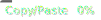

# first-contribution

[](https://github.com/plbstl/first-contribution/actions/workflows/linter.yml)

[](https://github.com/plbstl/first-contribution/actions/workflows/codeql-analysis.yml)
[](./badges/coverage.svg) [](./badges/jscpd.svg)
[](https://app.fossa.com/projects/git%2Bgithub.com%2Fplbstl%2Ffirst-contribution?ref=badge_shield)

Automatically respond to a user's first issue or pull request in your repository.

- **Flexible Tracking**: Greet users on their first issue and first pull request separately, or just once on their very
  first interaction.
- **Custom Messages**: Define unique messages for different events like opening an issue, merging a PR, or closing a
  contribution.
- **Automatic Labeling**: Apply labels to issues and PRs from new contributors to help with triage.
- **Placeholder Support**: Use `{fc-author}` in any message to mention the contributor by their GitHub username.
- **Message Reuse**: Avoid repetition by reusing message content from other inputs.

## Usage

You can respond to first-time contributors when they open new issues and pull requests, and you can also respond when
those contributions are closed.

- All inputs are optional.
- If a message input (e.g., `issue-opened-msg`) is not provided, no comment will be made for that event.
- If no label inputs are provided, the issue or pull request labels will remain untouched.
- You can use `{fc-author}` in any of the `-msg` inputs to reference the issue or pull request author's username.
- You can reuse messages by passing another message input's name as the value. See the
  [Detailed example](#detailed-configuration) for more information.

> [!NOTE]
>
> The `labels` inputs (`labels`, `issue-labels`, and `pr-labels`) are only applied when an issue or pull request is
> opened. They do not apply to `closed` events.

<!--  -->

> [!IMPORTANT]
>
> Make sure your workflow is configured to listen to the necessary events and has been granted the required
> `permissions` for the action to function correctly. See the [examples below](#examples).

### Inputs 📥

| Input                   | Description                                                                                                                                                                                                                      | Default               |
| ----------------------- | -------------------------------------------------------------------------------------------------------------------------------------------------------------------------------------------------------------------------------- | --------------------- |
| `token`                 | The GitHub access token used to add comments and labels.                                                                                                                                                                         | `${{ github.token }}` |
| `issue-opened-msg`      | Message to post on a first-time contributor's first issue.                                                                                                                                                                       | `''`                  |
| `pr-opened-msg`         | Message to post on a first-time contributor's first pull request.                                                                                                                                                                | `''`                  |
| `issue-completed-msg`   | Message to post when a first-time contributor's issue is closed as 'completed'.                                                                                                                                                  | `''`                  |
| `issue-not-planned-msg` | Message to post when a first-time contributor's issue is closed as 'not planned'.                                                                                                                                                | `''`                  |
| `pr-merged-msg`         | Message to post when a first-time contributor's pull request is merged.                                                                                                                                                          | `''`                  |
| `pr-closed-msg`         | Message to post when a first-time contributor's pull request is closed without merging.                                                                                                                                          | `''`                  |
| `labels`                | Comma-separated list of labels to add to any issue or PR from a first-time contributor **when opened**.                                                                                                                          | `''`                  |
| `issue-labels`          | Comma-separated list of labels for a first-time issue **when opened**. Takes precedence over `labels`.                                                                                                                           | `''`                  |
| `pr-labels`             | Comma-separated list of labels for a first-time pull request **when opened**. Takes precedence over `labels`.                                                                                                                    | `''`                  |
| `contribution-mode`     | Controls how first contributions are tracked.<br/>- (default): Triggers for a user's first issue AND their first PR separately.<br/>- `once`: Triggers only on the user's absolute first contribution (either an issue OR a PR). | `''`                  |

### Outputs 📤

| Output        | Type    | Description                                                                        |
| ------------- | ------- | ---------------------------------------------------------------------------------- |
| `type`        | string  | The type of contribution. Can be `issue` or `pr`.                                  |
| `number`      | integer | The number of the issue or pull request.                                           |
| `username`    | string  | The GitHub username of the first-time contributor.                                 |
| `comment-url` | string  | The URL of the comment posted by the action. This is empty if no comment was made. |

## Examples

- [Welcome First-Time Contributors (Issues & PRs)](#welcome-first-time-contributors-issues--prs)
- [Welcome a Contributor Only Once](#welcome-a-contributor-only-once)
- [Add New Contributor After Merge](#add-new-contributor-after-merge)
- [Detailed Configuration](#detailed-configuration)

### Welcome First-Time Contributors (Issues & PRs)

Welcome users when they open their first issue and their first pull request. Also, add a label to each.

```yaml
name: Welcome First-Time Contributor

on:
  issues:
    types: opened
  pull_request_target:
    types: opened

jobs:
  welcome:
    runs-on: ubuntu-latest
    permissions:
      issues: write
      pull-requests: write
    steps:
      - uses: plbstl/first-contribution@v4
        with:
          labels: first-contribution
          issue-opened-msg: |
            ### Hey @{fc-author}! :wave:
            Thanks for opening your first issue in this project! Welcome to the community. :heart:
          pr-opened-msg: |
            ### Hey @{fc-author}! :tada:
            Thanks for opening your first pull request! We appreciate your contribution.
```

### Welcome a Contributor Only Once

Use `contribution-mode: once` to welcome a user only on their absolute first interaction, whether it's an issue or a PR.

```yaml
name: Welcome a Contributor (Once)

on:
  issues:
    types: opened
  pull_request_target:
    types: opened

jobs:
  welcome:
    runs-on: ubuntu-latest
    permissions:
      issues: write
      pull-requests: write
    steps:
      - uses: plbstl/first-contribution@v4
        with:
          contribution-mode: once
          issue-opened-msg: >
            Welcome @{fc-author}! Thanks for your first contribution to our project. We're excited to have you here!
            :heart:
          # Reuse the same message for PRs for a consistent welcome
          pr-opened-msg: issue-opened-msg
```

### Add New Contributor After Merge

Add a new contributor after their first PR is merged, using the
[@all-contributors bot](https://github.com/apps/allcontributors).

```yaml
name: Add New Contributor

on:
  pull_request_target:
    types: closed

jobs:
  add-contributor:
    # This job only runs for merged PRs
    if: github.event.pull_request.merged == true
    runs-on: ubuntu-latest
    permissions:
      pull-requests: write
    steps:
      - uses: plbstl/first-contribution@v4
        with:
          pr-merged-msg: >
            @all-contributors please add @{fc-author} for ${{ join(github.event.pull_request.labels.*.name, ', ') }}
```

### Detailed Configuration

- Add different labels for first-time issues and PRs.
- Comment on opened and closed events.
- Reuse message text across different inputs.

```yaml
name: Detailed First Contribution Flow

on:
  issues:
    types: [opened, closed]
  pull_request_target:
    types: [opened, closed]

jobs:
  process-contribution:
    runs-on: ubuntu-latest
    permissions:
      issues: write
      pull-requests: write
    steps:
      - uses: plbstl/first-contribution@v4
        with:
          issue-labels: first-issue, needs-triage
          pr-labels: first-pr, needs-review

          # Reuse message text by referencing the input parameter name.
          pr-opened-msg: issue-opened-msg
          pr-merged-msg: issue-completed-msg
          pr-closed-msg: issue-not-planned-msg

          # Messages
          issue-opened-msg: |
            ### Hey @{fc-author}!

            Looks like it's your first time interacting with (Project Name) here on GitHub.
            Welcome and thank you for taking the time to report an issue :heart:.

            Please check out our [code of conduct](https://github.com/user/repo/blob/main/CODE_OF_CONDUCT.md) and [contribution guide](https://github.com/user/repo/blob/main/CONTRIBUTING.md) to learn how to interact with and contribute to the community.

            Don't forget to star :star: the repo.
          issue-completed-msg: |
            ### Hey @{fc-author}!

            Thank you for your contribution. We appreciate it and hope to see you again!
          issue-not-planned-msg: |
            ### Hey @{fc-author}!

            Thank you for taking the time to contribute. While this wasn't merged, we value your effort and encourage you to contribute again in the future.
```


## License
[](https://app.fossa.com/projects/git%2Bgithub.com%2Fplbstl%2Ffirst-contribution?ref=badge_large)